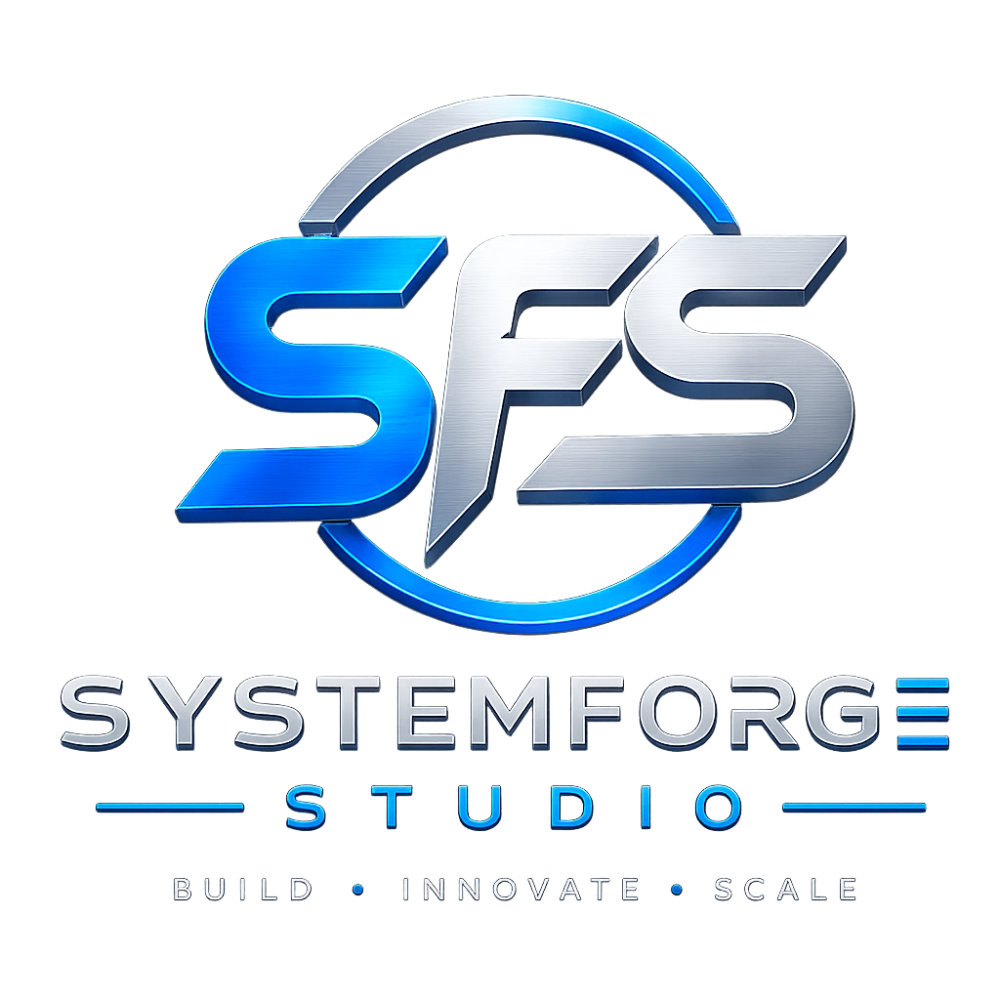

# SystemForge Studio

[English](../../README.md) | العربية | [کوردی](README.ckb.md) | [简体中文](README.zh-CN.md) | [臺灣正體](README.zh-TW.md)

<p align="center">
  <a href="https://systemforge-studio.github.io/systemforge-website/">
    
  </a>
</p>

## نبني - نبتكر - نتوسع

SystemForge Studio (SFS) هو استوديو هندسة برمجيات حديث يركز على بناء أنظمة ويب وجوال وخلفية وأنظمة جاهزة للسحابة وقابلة للتوسع، باستخدام بنية نظيفة وممارسات تطوير حديثة.

يمثل موقع الحافظة هذا الحضور الهندسي العام لـ SFS، ويعرض خدماتنا وقدراتنا التقنية وخبرتنا في بنية الأنظمة ونهجنا في تسليم البرمجيات.

---

# نبذة

يساعد SystemForge Studio الشركات على تحويل الأفكار إلى حلول برمجية قابلة للتوسع وآمنة وجاهزة للإنتاج.

يركز نهجنا الهندسي على:

- البنية النظيفة
- الأنظمة القابلة للصيانة
- تصميم خلفيات قابلة للتوسع
- واجهات API آمنة
- منصات الجوال والويب
- النشر الجاهز للسحابة
- سير عمل هندسي حديث

نتخصص في هندسة full-stack، وأنظمة الخلفية، وتطوير الجوال، وبنية الأنظمة، والتكاملات، وخطوط النشر الحديثة.

---

# التقنيات المستخدمة

## الواجهة الأمامية والجوال

- React
- React Native
- Next.js
- Expo
- TypeScript
- JavaScript
- HTML5
- CSS3
- Tailwind CSS
- Bootstrap

## الخلفية وواجهات API

- Node.js
- Express.js
- Python
- FastAPI
- Java
- ASP.NET Core
- REST APIs
- WebSockets
- Socket.IO
- JWT Authentication
- Prisma ORM

## قواعد البيانات والأنظمة

- PostgreSQL
- MongoDB
- MySQL
- SQLite
- Redis
- Firebase

## السحابة وDevOps

- Docker
- Railway
- Vercel
- AWS
- Azure
- CI/CD
- GitHub Actions

## ممارسات هندسية

- Microservices Architecture
- API Gateway
- OOP Design
- MVC Architecture
- RBAC Authorization
- Secure Backend Engineering
- Agile / Scrum
- SDLC
- QA Testing
- System Integration

---

# مشاريع مميزة

## تحديث EquiTip

ترحيل منصة جوال قديمة مبنية على low-code إلى بنية React Native وخدمات مصغرة قابلة للتوسع باستخدام PostgreSQL وAPI Gateway ومصادقة JWT وخدمات خلفية آمنة.

## منصة الحماية من السقوط بالذكاء الاصطناعي

منصة سلامة للجوال تتضمن كشف مخاطر بمساعدة الذكاء الاصطناعي، وسير عمل موجه، ومزامنة تعمل دون اتصال أولا، وقدرات تصدير PDF.

## أنظمة أعمال مخصصة

تطوير أدوات داخلية ولوحات معلومات وواجهات API وقواعد بيانات وأنظمة أتمتة سير عمل قابلة للتوسع للعمليات التجارية.

---

# الميزات

- واجهة حديثة ومتجاوبة
- تصميم هندسي داكن واحترافي
- هوية تركز على بنية الأنظمة
- قسم لعرض الفريق
- تصور للتقنيات المستخدمة
- عرض المشاريع
- نظرة عامة على الخدمات
- قسم تواصل
- بنية نظيفة قائمة على المكونات
- تخطيط متجاوب بالكامل

---

# بنية المشروع

```text
src/
├── assets/
├── components/
│   ├── layout/
│   ├── sections/
│   └── ui/
├── constants/
├── data/
├── types/
├── App.tsx
├── main.tsx
└── index.css
```

---

# إعداد التطوير

استنسخ المستودع:

```bash
git clone https://github.com/systemforge-studio/systemforge-website.git
```

ادخل إلى المشروع:

```bash
cd systemforge-website
```

ثبت الاعتمادات:

```bash
npm install
```

شغل خادم التطوير:

```bash
npm run dev
```

ابن نسخة الإنتاج:

```bash
npm run build
```

---

# أهداف التصميم

صمم هذا الموقع وفق المبادئ الهندسية التالية:

- تماسك عال
- اقتران منخفض
- بنية قابلة للصيانة
- إعادة استخدام المكونات
- هيكل مشروع قابل للتوسع
- اتساق واجهة حديث
- هوية احترافية
- تنظيم نظيف للكود

---

# تحسينات مستقبلية

- دراسات حالة مباشرة للمشاريع
- مخططات بنية الأنظمة
- عرض عملاء حقيقيين
- تكامل GitHub
- مدونة / مقالات هندسية
- تكامل CMS
- خلفية لنموذج التواصل
- ملفات تعريف أعضاء الفريق
- أتمتة النشر
- تكامل التحليلات

---

# التواصل

### SystemForge Studio

البريد الإلكتروني:

منظمة GitHub:  
https://github.com/systemforge-studio

---

# الترخيص

هذا المشروع جزء من الحضور العام للحافظة والهوية الخاصة بـ SystemForge Studio.
